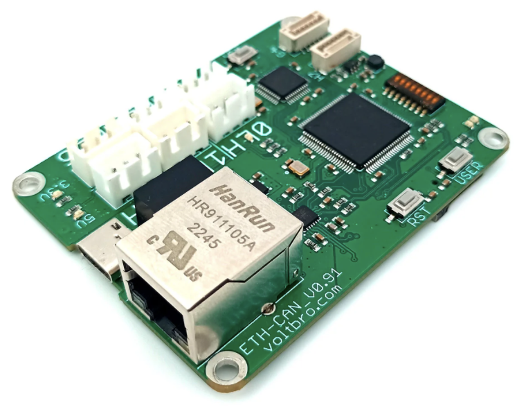

## Ethernet-CAN board


http://vbcores.com/products/ethernet-can




### Configure board

You need any SD-Card, format it to ```FAT16```

Write to root dir ```ethernet.ini``` file. See [example](./extra/SD-card/ethernet.ini) file.

### Firmware

Use STM32CubeProgrammer tools

You need [ST-Link](https://vbcores.tilda.ws/products/vb-stlink) for uploads.

Current binaries are located at https://github.com/VBCores/ETH-FDCAN_firmware 

### Build and Install

You need clone git repo with submodules.

```
git clone --recurse-submodules https://github.com/VBCores/ethernet-can
cd build
cmake ..
cmake --build .
sudo cmake --install .
```
After install look /opt/voltbro


#### Config

```
/opt/voltbro/ethernet-can/config.ini
```

For manual start, run ethernet-can startup script 
```
/opt/voltbro/bin/start_ethernet-can.sh
```

#### Add to system startup

```
sudo cp ./extra/ethernet-can.service /lib/systemd/system/
```

```
sudo systemctl start ethernet-can.service
sudo systemctl enable ethernet-can.service
```

After start, you see vcan[0-6] devices.


### libs
https://github.com/metayeti/mINI
