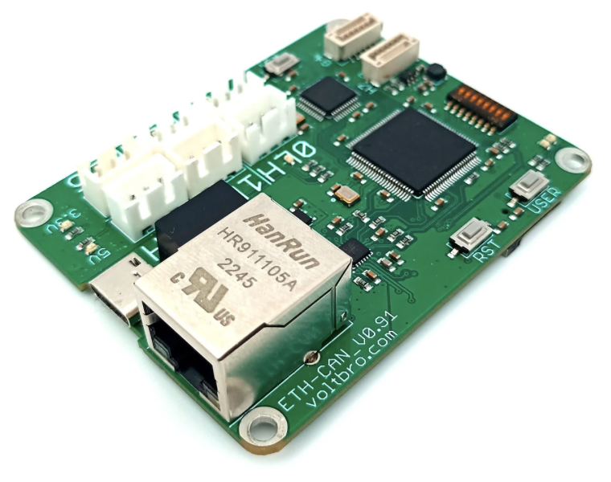

# Ethernet-CAN board

http://vbcores.com/products/ethernet-can



## Setup

### 1. Hardware

Solder all CAN-FD jumper pads on the back side of the board to enable termination on each channel. Without proper termination, CAN communication will not work.

### 2. Firmware

1. Use STM32CubeProgrammer with [ST-Link](https://vbcores.tilda.ws/products/vb-stlink) for flashing.
2. Firmware binaries: [download latest here](https://github.com/VBCores/ETH-FDCAN_firmware/releases) for BOTH H7 and G4
3. Flash BOTH H7 and G4. See named connectors on the board
    - On the G4 chip, set Option Byte `NSWBoot0` to `0` (unchecked in `OB -> Option Bytes`).

### 3. Configure board SD card

1. Format an SD card as `FAT16`.
2. Put `ethernet.ini` into the SD-card root directory.
3. Use [`extra/SD-card/ethernet.ini`](./extra/SD-card/ethernet.ini) as the template.

### 4. Host network configuration

Ethernet-CAN is an IP device that communicates over UDP. It reads a static device IP from SD card (`ethernet.ini`) and sends data to the static host IP. For reliable operation, ensure these 4 conditions:

1. Host and Ethernet-CAN are in the same network and have a direct/simple route between them.
2. Ethernet-CAN has a unique static IP (for example, not reused by DHCP).
3. Host IP never changes
4. Pair `[Ethernet-CAN IP; Host IP]` is unique. You can connect multiple (N) Ethernet-CAN boards to one host, but then host must be reachable under N different IPs. This limitation will be fixed in future releases.

There are many valid network topologies. This guide covers only the simplest direct point-to-point setup:

#### Straightforward P2P network configuration

1. Connect host and Ethernet-CAN directly with an Ethernet cable.
2. Find your physical Ethernet interface name using `ip link` (for example `eth0`).
3. Copy [`extra/10-ethernet-can.yaml`](./extra/10-ethernet-can.yaml) to `/etc/netplan`:
   `sudo install -m 0644 ./extra/10-ethernet-can.yaml /etc/netplan/10-ethernet-can.yaml`
4. Edit `/etc/netplan/10-ethernet-can.yaml`:
   - Replace `INTERFACE_NAME` with your interface name.
   - Keep `10.0.0.1/24` unless you intentionally changed host/device IPs in config files.
5. Run `sudo netplan try`, then `sudo netplan apply`.
6. Run `ip addr show INTERFACE_NAME` and verify the address is assigned.
7. Run `ping 10.0.0.2` (or your configured device IP). Ethernet-CAN should respond.

### 5. Host software installation

> This repository is intended to be built and installed on a Linux embedded host that controls the Ethernet-CAN board.

Install required tools and runtime components:

```bash
sudo apt update
sudo apt install -y build-essential cmake libboost-program-options-dev python3 python3-systemd can-utils iproute2 kmod
```

Clone with submodules:

```bash
git clone --recurse-submodules https://github.com/VBCores/ethernet-can
cd ethernet-can
```

Build and install:

```bash
cmake -S . -B build
cmake --build build
sudo cmake --install build
```

Installed files:

- `/opt/voltbro/ethernet-can/bin/ethernet-can`
- `/opt/voltbro/ethernet-can/bin/start_ethernet_can.py`
- `/opt/voltbro/ethernet-can/systemd/ethernet-can.service`

Note that `.ini` host config file is NOT installed automatically - this step is covered next.

### 6. Host INI configuration

Use [`extra/configs/example.ini`](./extra/configs/example.ini) as the runtime template.

> Simplest plan:
>
> - Copy [`extra/configs/example.ini`](./extra/configs/example.ini) to `/opt/voltbro/ethernet-can/`
> - Rename however you see fit
> - Update configuration: addresses, bitrate, etc.
>

You can have multiple `.ini` configs to talk to multiple EthernetCAN boards. Systemd unit that we will install later will manage them and run `ethernet-can` host process for each `.ini`. You can name them however you want, service will scan the directory for ALL `*.ini` files.

Prefer storing configuration files in `/opt/voltbro/ethernet-can`, otherwise update environment variables accordingly (see [`extra/ethernet-can.service`](./extra/ethernet-can.service) for env params).

Manual start for debugging:

```bash
sudo /opt/voltbro/ethernet-can/bin/start_ethernet_can.py
```

### 7. Install and enable systemd unit

> This is the last step. You can always undo/update this, but it helps to re-check all configs, unit files, etc. in `/opt/voltbro/ethernet-can` at this point to avoid confusion

Install the unit to system from the installed location:

```bash
sudo install -m 0644 /opt/voltbro/ethernet-can/systemd/ethernet-can.service /etc/systemd/system/ethernet-can.service
sudo systemctl daemon-reload
sudo systemctl enable --now ethernet-can.service
```

Check status/logs:

```bash
systemctl status ethernet-can.service
journalctl -u ethernet-can.service -f
```

After startup, the service creates and configures `vcan0..vcan5`, for example this should work (may be silent if no data on can-bus, but should NOT crash/exit):

```bash
candump vcan0
```

## Troubleshooting notes

- Before powering any CAN network, measure resistance between `CANH` and `CANL` with a multimeter. It should be about `60 Ohm` (two parallel `120 Ohm` terminators, one at each end of the line). If it is `120 Ohm`, one terminator is missing. Other values usually indicate a wiring/assembly issue.
- CAN uses two signal wires, but stable operation also requires a shared ground reference between all devices. If Ethernet-CAN and the target device are powered from different supplies, connect grounds explicitly.
- Recommended wire colors: `CANH` yellow, `CANL` green, ground black.

## Used libraries

- https://github.com/metayeti/mINI
