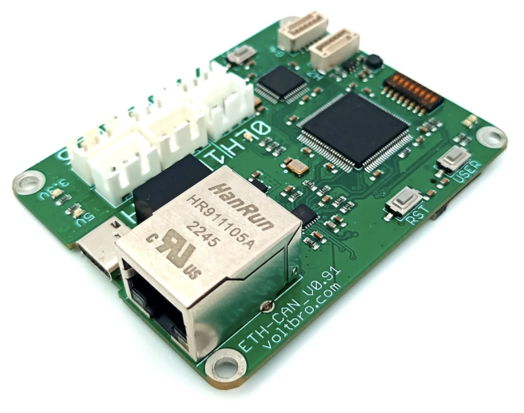

# Ethernet-CAN board

**[http://vbcores.com/products/ethernet-can](http://vbcores.com/products/ethernet-can)**



## Setup

### 1. Hardware

Solder all CAN-FD jumper pads on the back side of the board to enable termination on each channel. Without proper termination, CAN communication will not work.

### 2. Firmware

1. Use STM32CubeProgrammer with [ST-Link](https://vbcores.tilda.ws/products/vb-stlink) for flashing.
2. Firmware binaries: download latest from [releases](https://github.com/VBCores/ethernet-can/releases) for BOTH H7 and G4
3. Flash BOTH H7 and G4. See named connectors on the board
    - On the G4 chip, set Option Byte `NSWBoot0` to `0` (unchecked in `OB -> Option Bytes`).

### 3. Board SD card

A FAT SD card is required for persistent runtime config and for REST/panel config writes. The board reads JSON files from the SD-card root:

- `config.json`: user-owned config and locked fields. Firmware never overwrites it.
- `runtime.json`: last applied full runtime config. Firmware creates/updates it after successful REST or panel config.

1. Format an SD card as `FAT16`.
2. Put `config.json` into the SD-card root directory when you need identity, network, or locked FDCAN settings.
3. Use [`extra/SD-card/config.json`](./extra/SD-card/config.json) as the minimal template.

`config.json` may contain a `network` object with `hostname`, `mac_address`, `dhcp`, `host_ip`, `device_ip`, `netmask`, and `gateway`. If `device_ip` is present, firmware disables DHCP. If `mac_address` is omitted, firmware derives a locally administered MAC from the H7 hardware UID.

For board-managed setups, `config.json` can also contain the same runtime fields returned by `GET /api/v1/config`: `data_plane.host_ip`, `frames_integration_period_ns`, and `buses`. Any explicitly present runtime field is locked; a conflicting `PUT /api/v1/config` returns `409 Conflict`.

The board exposes a compact web panel at `http://<device>/panel`. `GET /api/v1/status` includes network state, FDCAN state, reset reason, IWDG health, queue drops, H7 bus-off counters, and SD persistence state.

### 4. Host network configuration

Ethernet-CAN is an IP device that communicates over HTTP REST for runtime configuration and UDP for CAN data. In static/P2P mode, ensure these 3 conditions:

1. Host and Ethernet-CAN are in the same network and have a direct/simple route between them.
2. Ethernet-CAN has a unique static IP (for example, not reused by DHCP).
3. Host IP never changes

Host-side bridge supports multiple Ethernet-CAN boards with different device IPs behind one shared host IP. Boards are distinguished on the host by UDP source IP.

There are many valid network topologies. For examples, see "[App Notes](./app_notes)". This guide covers only the simplest direct point-to-point setup:

#### Straightforward P2P network configuration

1. Connect host and Ethernet-CAN directly with an Ethernet cable.
2. Find your physical Ethernet interface name using `ip link` (for example `eth0`).
3. Copy [`extra/10-ethernet-can.yaml`](./extra/10-ethernet-can.yaml) to `/etc/netplan`:
   `sudo install -m 0644 ./extra/10-ethernet-can.yaml /etc/netplan/10-ethernet-can.yaml`
4. Edit `/etc/netplan/10-ethernet-can.yaml`:
   - Replace `INTERFACE_NAME` with your interface name.
   - Keep `10.0.0.1/24` unless you intentionally changed host/device IPs in config files.
5. Run `sudo netplan try`, then `sudo netplan apply`.
6. Run `ip addr show INTERFACE_NAME` and verify the address is assigned.
7. Run `ping 10.0.0.2` (or your configured device IP). Ethernet-CAN should respond.

### 5. Host software installation

> This repository is intended to be built and installed on a Linux embedded host that controls the Ethernet-CAN board.

Install required tools and runtime components:

```bash
sudo apt update
sudo apt install -y build-essential cmake libboost-program-options-dev python3 python3-systemd python3-requests python3-tenacity can-utils iproute2 kmod
```

Clone with submodules:

```bash
git clone --recurse-submodules https://github.com/VBCores/ethernet-can
cd ethernet-can
```

Build and install:

```bash
cmake -S . -B build
cmake --build build
sudo cmake --install build
```

Installed files:

- `/opt/voltbro/ethernet-can/bin/ethernet-can`
- `/opt/voltbro/ethernet-can/bin/start_ethernet_can.py`
- `/opt/voltbro/ethernet-can/systemd/ethernet-can.service`

Host JSON config files are not installed automatically - this step is covered next.

### 6. Host JSON configuration

Use [`extra/configs/example.json`](./extra/configs/example.json) as the runtime template.

Each `.json` describes one Ethernet-CAN board. The launcher scans all `*.json` files, validates them, creates the required VCAN interfaces, and starts one shared host process with all boards passed on the command line. `network.device_ip` can be either an IPv4 address or a hostname such as `ethernetcan.local`. Literal IPv4 addresses are used directly. Hostnames are resolved at startup and re-resolved if UDP arrives from an unknown source, so a board can recover after reboot if DHCP gives the same hostname a new address.

Top-level host JSON has mandatory `network` and optional `fdcan`. `network.host_interface_map` defines both bus enablement and Linux interface mapping. A bus is enabled if it is present in that object. Example:

```json
{
  "network": {
    "host_ip": "192.168.2.2",
    "device_ip": "ethernetcan.local",
    "host_interface_map": {
      "bus0": "vcan1.0",
      "bus1": "vcan1.1",
      "bus2": "vcan1.2"
    }
  },
  "fdcan": {
    "period_ns": 10000000,
    "nominal_kbit": 1000,
    "data_kbit": 8000
  }
}
```

In this example, only buses `0`, `1`, and `2` are enabled for that board.

If `fdcan` is present, the launcher owns the board runtime config: it sends `PUT /api/v1/config` before starting the UDP data plane and reapplies it on healthcheck mismatch. If `fdcan` is absent, the launcher does not configure the board. It waits until the board reports an applied runtime config, takes `frames_integration_period_ns` from the board, and starts the host binary.

> Simplest plan:
>
> - Copy [`extra/configs/example.json`](./extra/configs/example.json) to `/opt/voltbro/ethernet-can/`
> - Rename however you see fit
> - Update configuration: addresses, bitrate, and host CAN interface map
>
>> Dev note: JSON configs are parsed only by the Python launcher. The host binary is only the UDP data plane. You can start it directly by passing required CLI parameters yourself, but then you must configure the board separately.

Prefer storing configuration files in `/opt/voltbro/ethernet-can`, otherwise update environment variables accordingly (see [`extra/ethernet-can.service`](./extra/ethernet-can.service) for env params).

The launcher keeps watching each board while the host data plane is running. It polls `GET /api/v1/status` at `ETHERNET_CAN_HEALTHCHECK_HZ`. For host-managed configs, it compares the reported runtime config with the requested JSON and sends `PUT /api/v1/config` again after repeated mismatch or no-response failures. For board-managed configs, it only checks that a compatible applied config is still reported. Defaults are `1.0` Hz and `3` tolerated consecutive failures. `ETHERNET_CAN_CONFIG_WAIT_TIMEOUT_SECONDS=-1` makes listener-only startup wait forever for board config.

Manual start for debugging:

```bash
sudo /opt/voltbro/ethernet-can/bin/start_ethernet_can.py
```

### 7. Install and enable systemd unit

> This is the last step. You can always undo/update this, but it helps to re-check all configs, unit files, etc. in `/opt/voltbro/ethernet-can` at this point to avoid confusion

Install the unit to system from the installed location:

```bash
sudo install -m 0644 /opt/voltbro/ethernet-can/systemd/ethernet-can.service /etc/systemd/system/ethernet-can.service
sudo systemctl daemon-reload
sudo systemctl enable --now ethernet-can.service
```

Check status/logs:

```bash
systemctl status ethernet-can.service
journalctl -u ethernet-can.service -f
```

After startup, the launcher creates and configures the interfaces referenced by `network.host_interface_map`. For example, with the current template this should work (may be silent if no data on CAN bus, but should NOT crash/exit):

```bash
candump vcan1.0
```

## Troubleshooting notes

- Before powering any CAN network, measure resistance between `CANH` and `CANL` with a multimeter. It should be about `60 Ohm` (two parallel `120 Ohm` terminators, one at each end of the line). If it is `120 Ohm`, one terminator is missing. Other values usually indicate a wiring/assembly issue.
- CAN uses two signal wires, but stable operation also requires a shared ground reference between all devices. If Ethernet-CAN and the target device are powered from different supplies, connect grounds explicitly.
- Recommended wire colors: `CANH` yellow, `CANL` green, ground black.
